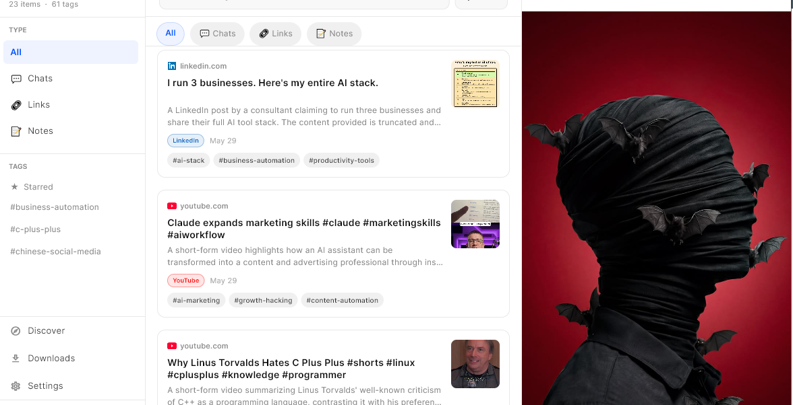

# Enclo

Your AI memory capsule: a local-first place to save AI chats, links, notes, and videos so they can be found again in seconds.

Live site: [https://getenclo.web.app](https://getenclo.web.app)



## Overview

Enclo is a private, searchable archive for the useful things people collect while working with AI. The landing page introduces the product, its privacy-first positioning, supported platforms, Stremit API integration, and early-access flow.

This repository contains the static marketing site for Enclo. It is built as plain HTML, CSS, and JavaScript, then deployed with Firebase Hosting.

## Highlights

- Save AI conversations from ChatGPT, Claude, Gemini, Perplexity, Copilot, and other tools.
- Store links, notes, and downloaded video references in one searchable capsule.
- Use Deep Search, auto-tagging, and summarization with a Stremit API key.
- Keep core data local-first and private by default.
- Share capsule items peer-to-peer with CloShare.
- Present Android and Windows beta availability, with iOS and macOS listed as coming soon.

## Tech Stack

- Static HTML, CSS, and vanilla JavaScript
- Firebase Hosting
- Responsive single-page layout
- Inline SVG illustrations and local image assets

## Project Structure

```text
.
|-- public/
|   |-- enclo-icon.svg
|   |-- hero-screenshot.png
|   `-- index.html
|-- .firebaserc
|-- firebase.json
`-- README.md
```

## Getting Started

Because this is a static site, you can open `public/index.html` directly in a browser.

For a local server preview, use any static file server. For example:

```bash
npx serve public
```

Or with the Firebase CLI:

```bash
firebase emulators:start --only hosting
```

## Deployment

The site is configured for Firebase Hosting with `public` as the deploy directory.

```bash
firebase deploy --only hosting
```

The Firebase project configured in `.firebaserc` is:

```text
getchatvault
```

## Firebase Hosting Notes

The current hosting configuration:

- Serves all static files from `public/`
- Rewrites all routes to `/index.html`
- Adds basic security headers
- Caches HTML, CSS, and JavaScript assets for one hour

## Brand

Enclo is positioned as:

> Your AI conversations, never lost again.

Core message:

> Save AI chats, links, notes, and videos. Find anything in seconds. Free, private, local-first.

## License

No license has been added yet. Add one before accepting external contributions.
